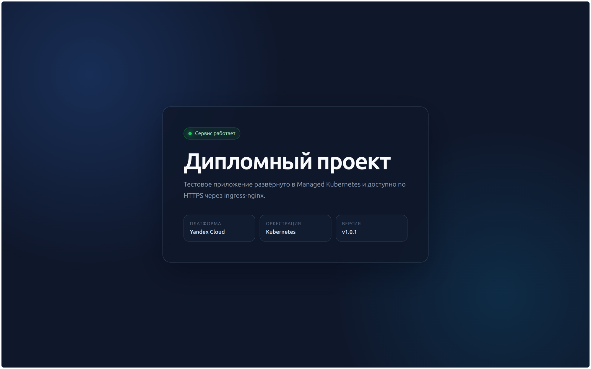
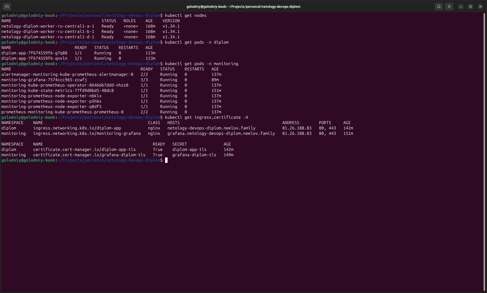
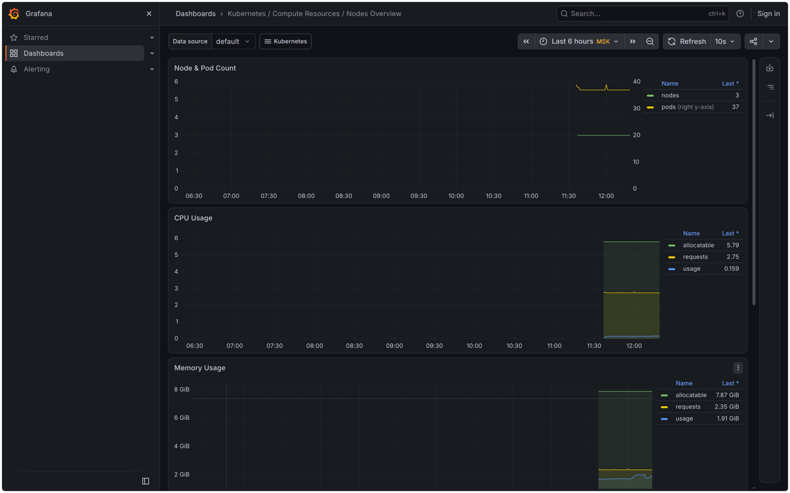
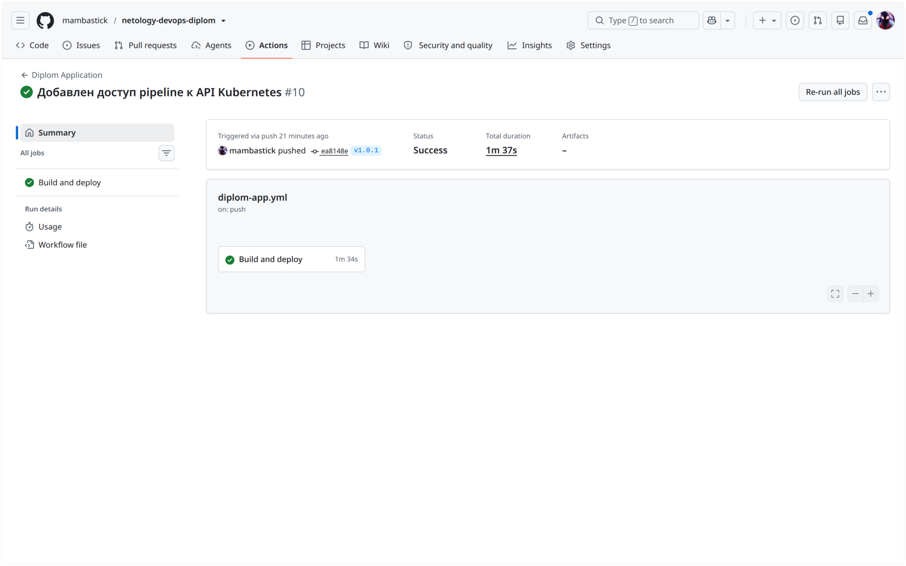
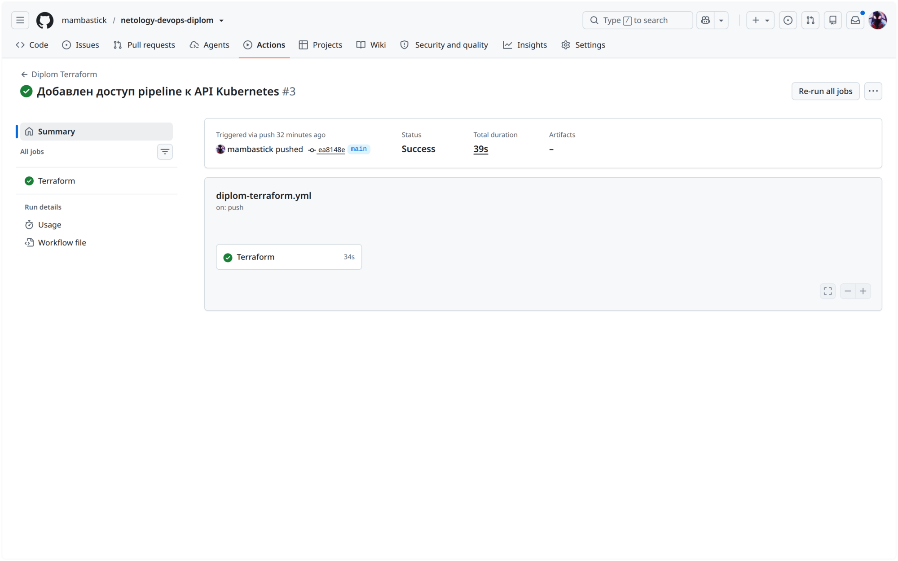

# Дипломный проект в Yandex Cloud

[Задание на диплом](https://github.com/netology-code/devops-diplom-yandexcloud)

Стенд сейчас работает и доступен из интернета:

- [тестовое приложение](https://netology-devops-diplom.neelov.family);
- [Grafana](https://grafana.netology-devops-diplom.neelov.family) — дашборды открываются без входа в режиме просмотра;
- [Docker-образ приложения](https://github.com/mambastick/netology-devops-diplom/pkgs/container/netology-devops-diplom) — `ghcr.io/mambastick/netology-devops-diplom:v1.0.1`;
- [все запуски GitHub Actions](https://github.com/mambastick/netology-devops-diplom/actions).

Оба сайта работают по HTTPS. Обычные HTTP-запросы ingress-nginx перенаправляет на HTTPS, сертификаты выпускает и обновляет cert-manager через Let's Encrypt.

## Что развёрнуто

Основную инфраструктуру создаёт Terraform: VPC, три подсети, Yandex Container Registry и региональный Managed Kubernetes. В кластере три прерываемые worker-ноды — по одной в `ru-central1-a`, `ru-central1-b` и `ru-central1-d`. Terraform state хранится в отдельном бакете Object Storage с версионированием и шифрованием KMS.

Приложение — статическая страница на nginx. Контейнер запускается без root-прав, слушает порт `8080` и отвечает на проверку `/healthz`. В Kubernetes работают две реплики, снаружи они доступны через общий Ingress.

Мониторинг установлен chart'ом `kube-prometheus-stack`: Prometheus, Alertmanager, Grafana, kube-state-metrics и node-exporter. Grafana получает метрики со всех трёх worker-нод. Компоненты control plane, которые скрыты в Managed Kubernetes, отключены в настройках chart'а.

## Автоматизация

Для разных частей стенда оставлены отдельные workflow:

- [`diplom-terraform.yml`](.github/workflows/diplom-terraform.yml) проверяет конфигурацию Terraform, строит plan и применяет его для `main`;
- [`diplom-platform.yml`](.github/workflows/diplom-platform.yml) устанавливает ingress-nginx, cert-manager и мониторинг;
- [`diplom-app.yml`](.github/workflows/diplom-app.yml) собирает приложение, отправляет образ в Yandex Container Registry и GitHub Container Registry, затем обновляет Deployment.

Обычный коммит в `main`, затрагивающий приложение, получает тег образа вида `sha-xxxxxxx`. При создании Git-тега `v1.0.1` тот же тег получает Docker-образ, который после сборки разворачивается в кластере.

- [успешный запуск Terraform](https://github.com/mambastick/netology-devops-diplom/actions/runs/32563250879);
- [установка платформенных компонентов](https://github.com/mambastick/netology-devops-diplom/actions/runs/32564912614);
- [сборка и деплой версии `v1.0.1`](https://github.com/mambastick/netology-devops-diplom/actions/runs/32563687447).

## Проверка

```bash
terraform -chdir=terraform/infrastructure plan
kubectl get nodes -o wide
kubectl get pods --all-namespaces
kubectl get ingress,certificate --all-namespaces
helm status monitoring -n monitoring
curl -I https://netology-devops-diplom.neelov.family
```

### Приложение



### Состояние Kubernetes



### Мониторинг



### Деплой приложения



### Terraform



Дополнительные снимки с выводом Terraform и `kubectl` находятся в каталоге [`docs/screenshots`](docs/screenshots).
