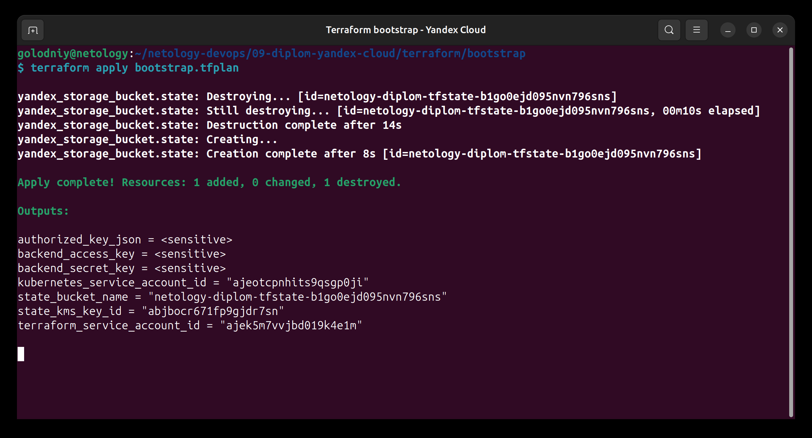

# Terraform bootstrap

Конфигурация создаёт начальные ресурсы, которые не зависят от основного Terraform state:

- сервисный аккаунт Terraform с набором целевых ролей;
- сервисный аккаунт Managed Kubernetes;
- версионируемый бакет Object Storage для Terraform state;
- KMS-ключ для шифрования state;
- статический S3-ключ и авторизованный ключ для CI/CD.

## Запуск

```bash
export YC_TOKEN="$(yc iam create-token)"
export TF_VAR_cloud_id="$(yc config get cloud-id)"
export TF_VAR_folder_id="$(yc config get folder-id)"
export TF_CLI_CONFIG_FILE="$PWD/../../terraform.rc"

terraform init
terraform plan -out=bootstrap.tfplan
terraform apply bootstrap.tfplan
```

Секретные outputs нельзя выводить в логи pipeline или добавлять в репозиторий. Авторизованный ключ можно сохранить в игнорируемый файл:

```bash
terraform output -raw authorized_key_json > ../../authorized_key.json
chmod 600 ../../authorized_key.json
```

## Результат

Bootstrap создан, повторный `terraform plan` не показывает изменений. Секретные outputs скрыты Terraform.


