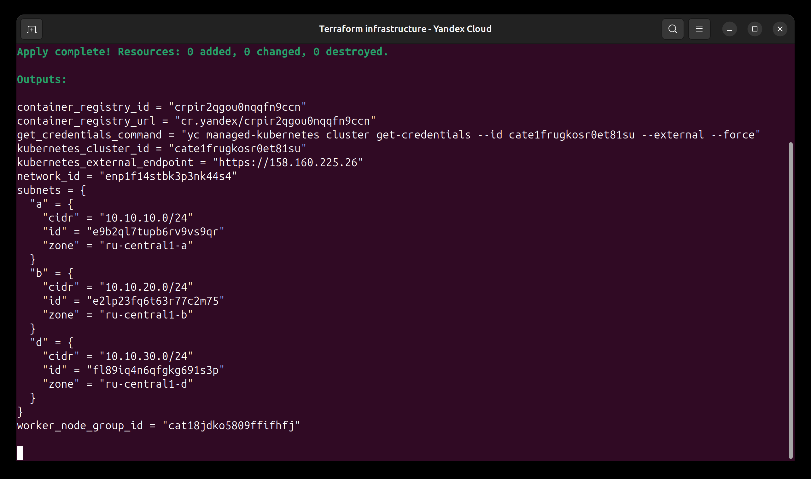
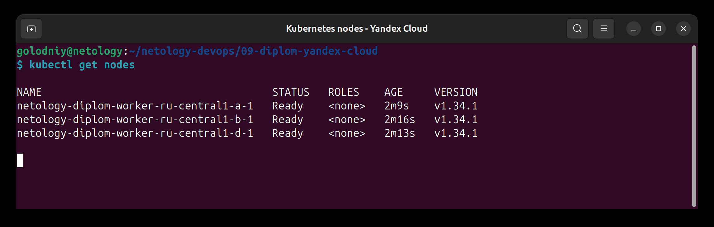
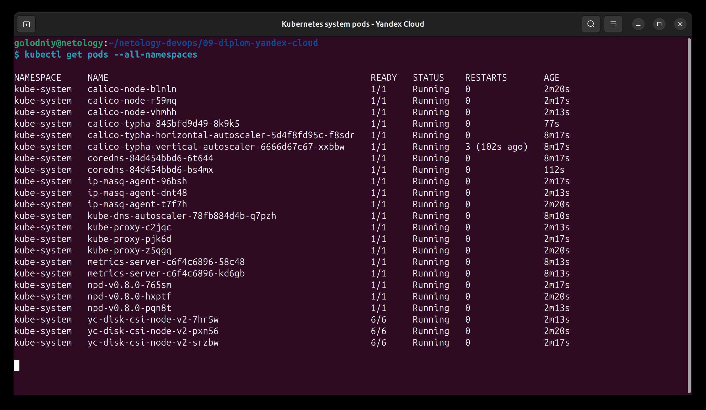

# Основная инфраструктура

Terraform создаёт VPC и три подсети, региональный Managed Kubernetes, группу из трёх прерываемых worker-узлов, Container Registry и KMS-ключ. State хранится в Object Storage, созданном bootstrap-конфигурацией.

## Инициализация

Перед первым запуском нужно скопировать `backend.hcl.example` в `backend.hcl` и указать имя созданного bucket.

```bash
export TF_CLI_CONFIG_FILE="$PWD/../../terraform.rc"
export AWS_ACCESS_KEY_ID="$(terraform -chdir=../bootstrap output -raw backend_access_key)"
export AWS_SECRET_ACCESS_KEY="$(terraform -chdir=../bootstrap output -raw backend_secret_key)"
export TF_VAR_cloud_id="$(yc config get cloud-id)"
export TF_VAR_folder_id="$(yc config get folder-id)"
export TF_VAR_kubernetes_service_account_id="$(terraform -chdir=../bootstrap output -raw kubernetes_service_account_id)"

terraform init -backend-config=backend.hcl
terraform plan -out=infrastructure.tfplan
terraform apply infrastructure.tfplan
```

После создания кластера:

```bash
eval "$(terraform output -raw get_credentials_command)"
kubectl get nodes -o wide
kubectl get pods --all-namespaces
```

## Экономия ресурсов

Worker-узлы создаются прерываемыми. После проверки и создания скриншотов основную инфраструктуру можно удалить, не затрагивая remote state и bootstrap-ресурсы:

```bash
terraform destroy
```

## Результат

Основная инфраструктура создана, а повторный `terraform apply` не выявил расхождений между конфигурацией и облаком.



В кластере работают три worker-узла Kubernetes 1.34, по одному в зонах `ru-central1-a`, `ru-central1-b` и `ru-central1-d`.



Все системные pod находятся в состоянии `Running`.


